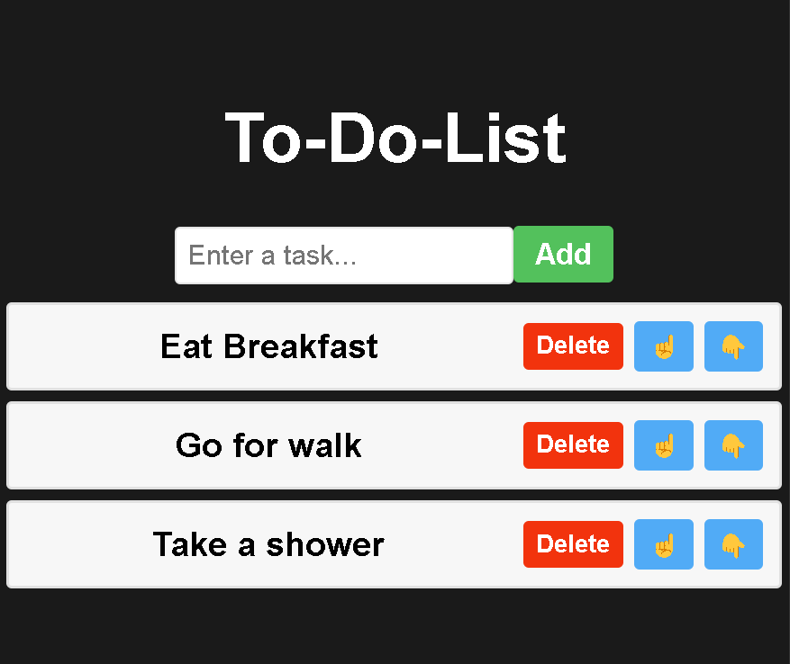
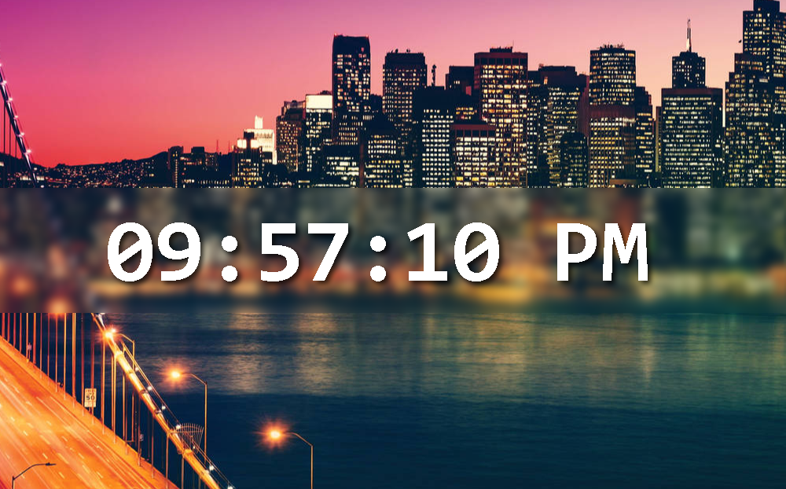
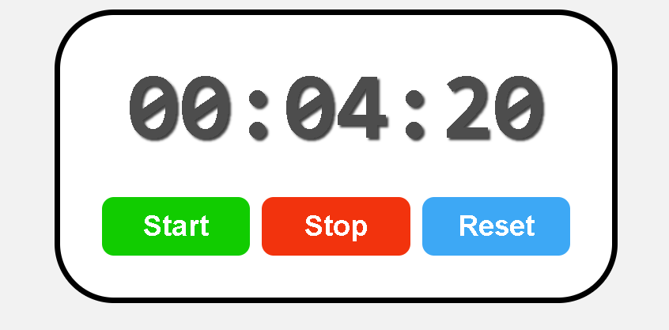

# Learning React JS
This repository is part of hand-on experience with react. It involves me building several small components to enhance my understanding on the library.

## Excercise 1: To Do List

## Excercise 2: Digital Clock

## Excercise 3: Stopwatch

